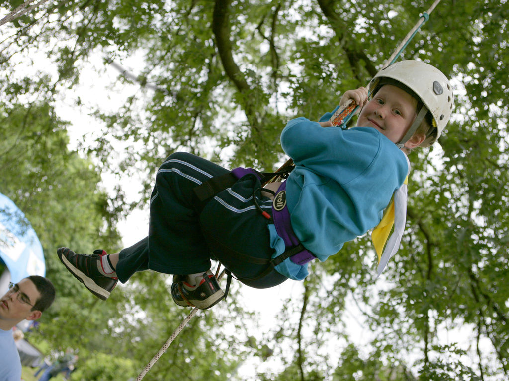

[<< Back](/)

# Beavers

Beaver Scouts are the youngest section of the Scouting family. Their activities are based around making things, outdoor activities, singing, playing games, going out on visits, investigating nature, listening to stories, learning how to be safe and most importantly, making new friends.

Age range: 6 to 8 years old

The Beaver Scout promise:

_I promise to do my best, 
To be kind and helpful, 
and to love God._

When a Beaver reaches the age of 8 they have the opportunity to move on to Cubs.

The Beaver Scout uniform may be purchased from [The Official Scout Shop](http://shop.scouts.org.uk/s-2-beavers.aspx?SectionFilterID=2&sectioncategories=true) or from John Lewis in Newcastle.

[Badge placement diagram for Beavers](media/BeaversUniformDiagram.pdf) (PDF)

## Sample programme
The word ‘programme’ in Scouting refers to the range of activities, challenges and experiences that young people experience in Scouting.
 
The Scouting programme provides a structure of badges and awards, which are progressive through the sections, and based on a number of objectives. The objectives are based on Scouting’s purpose to "actively engage and support young people in their personal development, empowering them to make a positive contribution to society".

Our programme is based around three main themes: outdoor and adventure, world and skills. This programme of activities is planned by the leadership team in partnership with young people, and should incorporates elements from each theme, to offer young people the most interesting and diverse experience. 

<iframe width="560" height="315" src="https://www.youtube-nocookie.com/embed/beWsc5kPwbc?rel=0" frameborder="0" allow="autoplay; encrypted-media" allowfullscreen></iframe>

## Autumn term
* Lodges & Beaver Games
* Fitness Games
* A tour of the historic streets of Morpeth
* Animal Night
* Fire Station Visit (4.30-5.30)
* Food!
* Halloween

HALF TERM

* Lino Cut Printing
* Knots etc
* Space Badge (Week 1)
* Space Badge (Week 2)
* Card delivery
* Carol Singing
* Christmas Crafts

