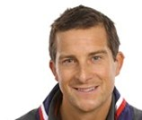
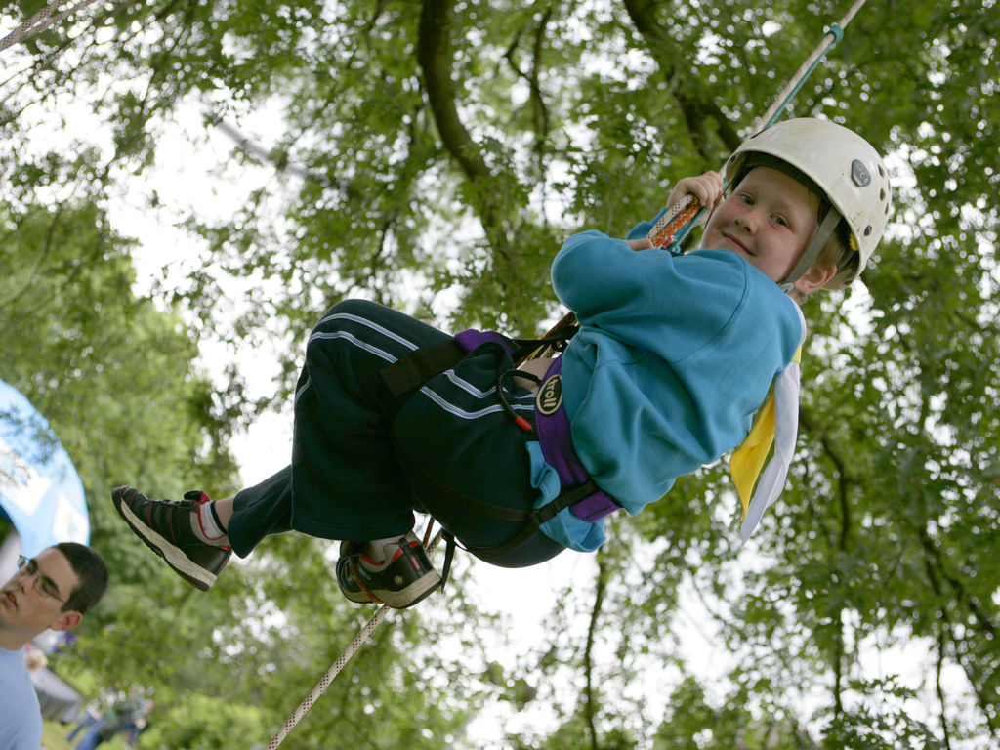
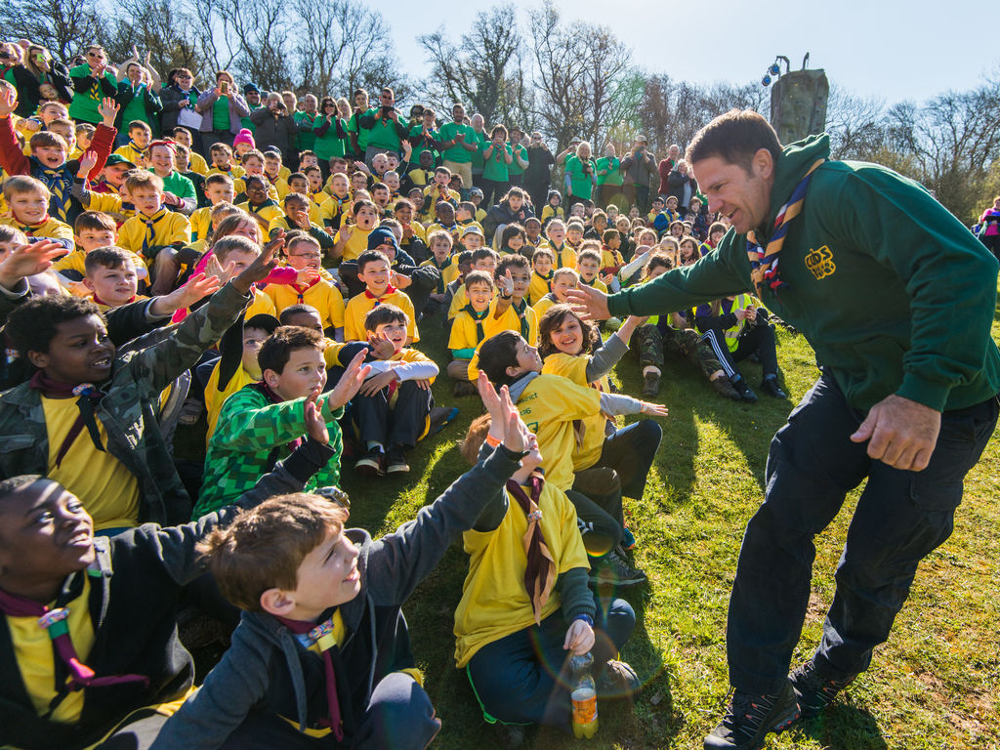
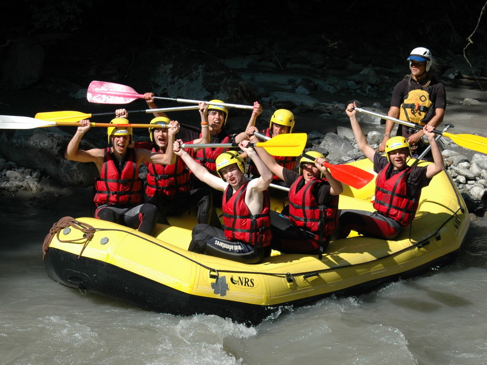

# About

<blockquote>"Every child has the right to an adventure. Life is about grabbing opportunities. The prizes don’t always go to the biggest, the best and the strongest – they go to those who persevere. These are simple life lessons that Scouting teaches." (Bear Grylls, Chief Scout)</blockquote>
  
Scouting offers challenge and adventure to almost 500,000 young people across the UK. 6th Morpeth Scouts are based in the Methodist Church in Morpeth, Northumberland ([map](http://www.openstreetmap.org/search?query=methodist%20church%20morpeth#map=18/55.17031/-1.68956)) and have over 100 members in two Beaver Colonies, two Cub Packs and two Scout Troops.

Find out more about: 

* [Beavers](#beavers)
* [Cubs](#cubs)
* [Scouts](#scouts)

More about UK Scouting can be found [here](http://scouts.org.uk).

-----

## <a name="beavers">Beavers</a>

Beaver Scouts are the youngest section of the Scouting family. Their activities are based around making things, outdoor activities, singing, playing games, going out on visits, investigating nature, listening to stories, learning how to be safe and most importantly, making new friends.

Age range: 6 to 8 years old

The Beaver Scout promise:

_I promise to do my best, 
To be kind and helpful, 
and to love God._

When a Beaver reaches the age of 8 they have the opportunity to move on to Cubs.

The Beaver Scout uniform may be purchased from [The Official Scout Shop](http://shop.scouts.org.uk/s-2-beavers.aspx?SectionFilterID=2&sectioncategories=true) or from John Lewis in Newcastle.

[Badge placement diagram for Beavers](media/BeaversUniformDiagram.pdf) (PDF)

-----

## <a name="cubs">Cubs</a>

Cubs is the second section of the Scouting movement, originally started in 1916 for younger brothers who wanted a 'look-in'. In nearly a century, the section has constantly evolved and adapted its programme and methods to meet the changing needs of each generation of young people.

Cub Scout you get opportunities to learn and take part in activities like swimming, computing, collecting, sports and exploring. They get badges for doing the activities properly. Cub Scouts will also take part on days out and get the opportunity to go camping and doing lots of outdoor activities.

Age range: 8 to 10½ years old

The Cub Scout promise:

_I promise that I will do my best 
To do my duty to God and to the Queen 
To help other people 
And to keep the Cub Scout Law_

When a Beaver reaches the age of 8 they have the opportunity to move on to Cubs

The Cub Scout uniform may be purchased from [The Official Scout Shop](http://shop.scouts.org.uk/s-3-cubs.aspx?SectionFilterID=3&sectioncategories=true) or from John Lewis in Newcastle.

[Badge placement diagram for Cubs](media/CubsUniformDiagram.pdf) (PDF)

-----

## <a name="scouts">Scouts</a>

Scouts are the third section of the Scouting movement. From the first experimental camp for 20 boys in 1907, the movement now has an estimated 28 million members worldwide, and in the UK alone there are over 499,000 boys and girls involved in Scouting. An increase in adult volunteers means that more and more young people are now able to take part in their own big adventure.

Scouts offer a wide range of interests from Information Technology, street sports, camping, entertainment, quad biking, yachting and conservation. As well as the outdoor activities, Scouts participate in a balanced programme that helps hem find out about the world they live in, the importance of keeping fit, and knowing their abilities.

Age range: 10½ to 14 years old

_On my honour, I promise that I will do my best 
To do my duty to God and to the Queen 
To help other people 
And to keep the Scout Law_

When a Scout reaches 14 they move on to Explorer Scouts.

The Scout uniform may be purchased from [The Official Scout Shop](http://shop.scouts.org.uk/s-8-scouts.aspx?SectionFilterID=8&sectioncategories=true) or from John Lewis in Newcastle.

[Badge placement diagram for Scouts](media/ScoutsUniformDiagram.pdf) (PDF)
