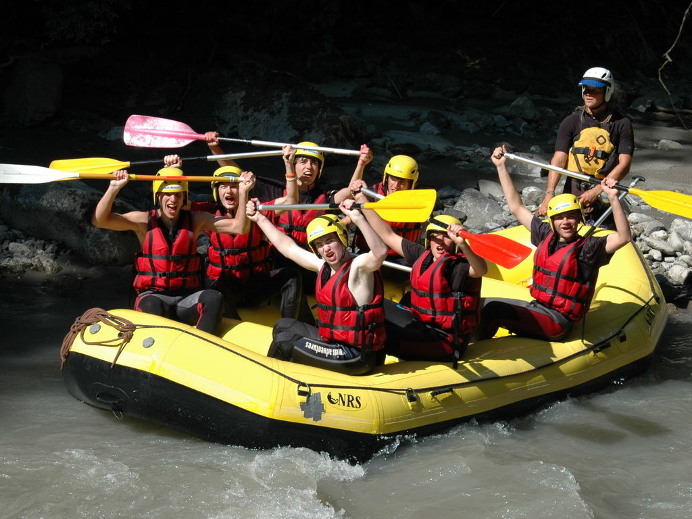

[<< Back](/)

# Scouts

Scouts are the third section of the Scouting movement. From the first experimental camp for 20 boys in 1907, the movement now has an estimated 28 million members worldwide, and in the UK alone there are over 499,000 boys and girls involved in Scouting. An increase in adult volunteers means that more and more young people are now able to take part in their own big adventure.

Scouts offer a wide range of interests from Information Technology, street sports, camping, entertainment, quad biking, yachting and conservation. As well as the outdoor activities, Scouts participate in a balanced programme that helps hem find out about the world they live in, the importance of keeping fit, and knowing their abilities.

Age range: 10½ to 14 years old

_On my honour, I promise that I will do my best 
To do my duty to God and to the Queen 
To help other people 
And to keep the Scout Law_

When a Scout reaches 14 they move on to Explorer Scouts.

The Scout uniform may be purchased from [The Official Scout Shop](http://shop.scouts.org.uk/s-8-scouts.aspx?SectionFilterID=8&sectioncategories=true) or from John Lewis in Newcastle.

[Badge placement diagram for Scouts](media/ScoutsUniformDiagram.pdf) (PDF)

## Sample programme

* Welcome back
* Games & Team Challenges
* World Challenge
* Camp preparation
* Expedition Challenge camp weekend
* Harvest Festival
* World Challenge part 1
* Scout restaurant week 1
* Operation Twilight
* Scout restaurant week 2
* Halloween cook out
* Scary faces competition

HALF TERM 

* Games Night
* First Aid 1
* Remembrance Day parade
* First Aid 2
* Clip and Climb, Cramlington
* Mosque visit
* American Football
* Toy service in church
* Christmas Bowling
* Christmas Party

<iframe width="560" height="315" src="https://www.youtube-nocookie.com/embed/beWsc5kPwbc?rel=0" frameborder="0" allow="autoplay; encrypted-media" allowfullscreen></iframe>

The word ‘programme’ in Scouting refers to the range of activities, challenges and experiences that young people experience in Scouting.
 
The Scouting programme provides a structure of badges and awards, which are progressive through the sections, and based on a number of objectives. The objectives are based on Scouting’s purpose to "actively engage and support young people in their personal development, empowering them to make a positive contribution to society".

Our programme is based around three main themes: outdoor and adventure, world and skills. This programme of activities is planned by the leadership team in partnership with young people, and should incorporates elements from each theme, to offer young people the most interesting and diverse experience. 
